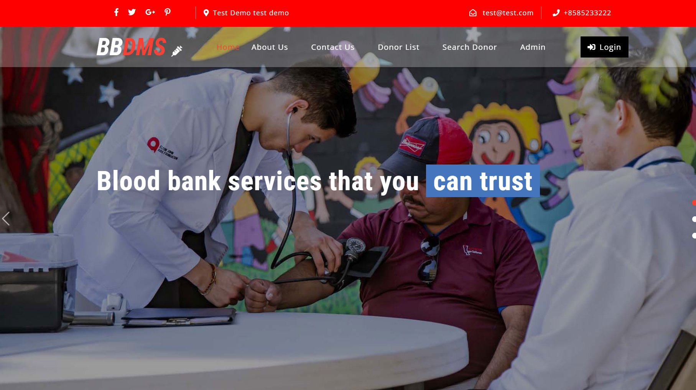
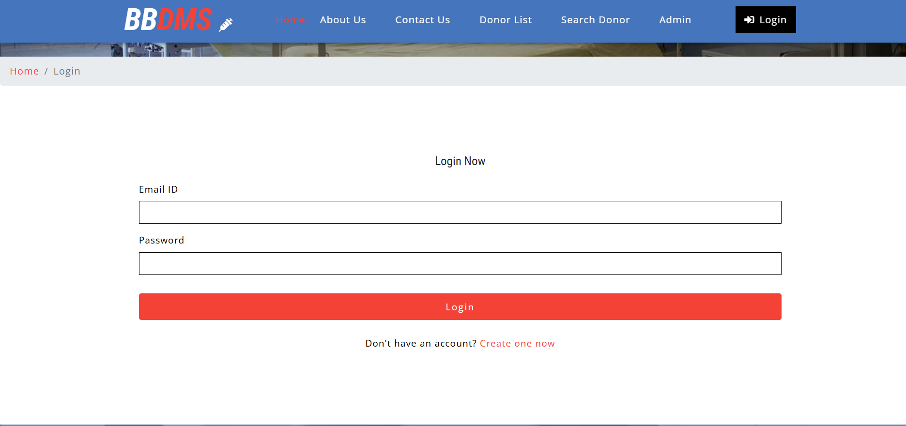
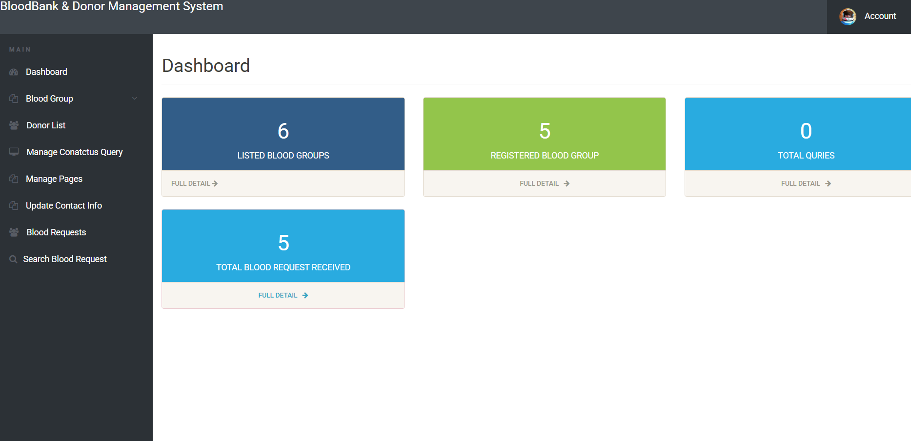
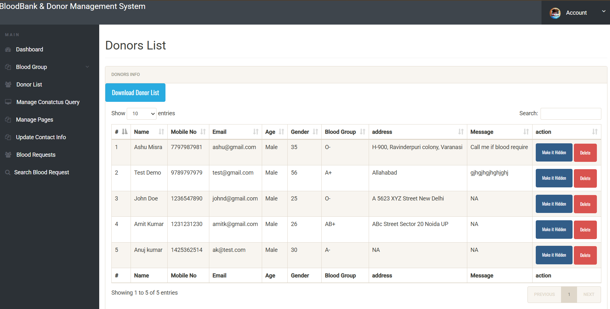
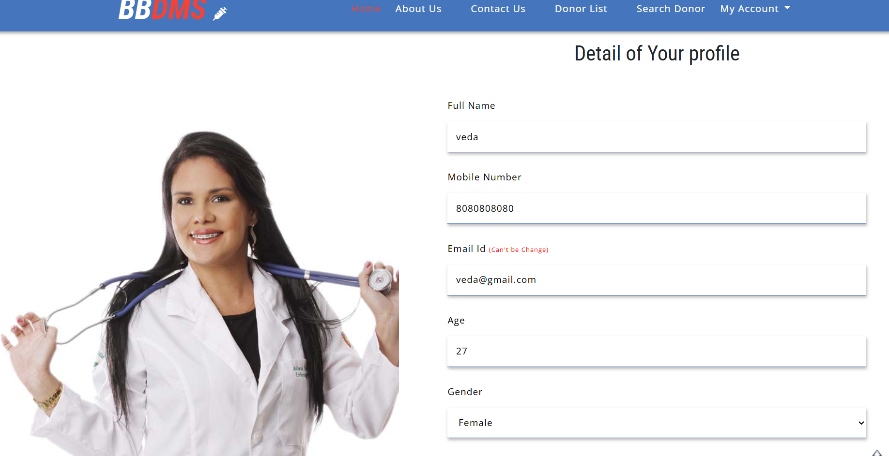
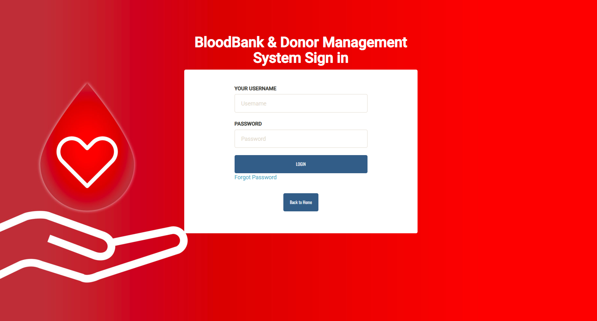

# 🩸 Blood Bank Management System

🚀 A web-based application that helps manage blood donors, search availability, and handle blood requests efficiently.

---

## 🔥 Features
✨ Donor Registration  
🔍 Search Blood Donors  
🩸 Blood Request System  
🔐 Admin Dashboard  
📱 Fully Responsive Design  

---

## 🛠️ Tech Stack

| Layer      | Technology |
|------------|-----------|
| Frontend   | HTML, CSS, JavaScript |
| Backend    | PHP |
| Database   | MySQL |
| Server     | Apache (AWS EC2) |

---

## ☁️ Deployment
✅ Deployed on AWS EC2 (Ubuntu)  
✅ Apache server configured  
✅ MySQL database imported and connected  
✅ GitHub used for version control  

---

## 🌐 Live Demo
🔗 http://13.49.230.195

---

## 📂 Project Structure
/admin → Admin dashboard  
/includes → Common files & config  
/css → Stylesheets  
/js → JavaScript files  
/index.php → Homepage  

---

## 📸 Screenshots

### 🏠 Home Page

### 🔐 Login Page

### 🛠️ Admin Dashboard

### 🩸 Donor List

### 👤 Donor Profile

### ⚙️ Admin Panel

---

## 👩‍💻 Author
Shital Kauthkar  
🎓 Student  
💡 Interested in Web Development  

---

## ⭐ Support
If you like this project, give it a ⭐ on GitHub!
